# 📝 **To-Do App (Flutter)**

A clean and minimal To-Do List application built with Flutter (Dart) — featuring local data storage, task categories, due dates, and light/dark mode.

## 🚀 **Features**

✅ Add, view, mark, and delete tasks  
🗂️ Categorize tasks (Work, Study, Personal)  
📅 Set due dates and view remaining days  
💾 Local storage using SharedPreferences  
🌙 Light / Dark mode toggle (saved preference)  
📊 Task counter (Completed vs Pending)  
🎨 Clean modern UI with rounded cards and Material icons

---

## 📸 Screenshots  

  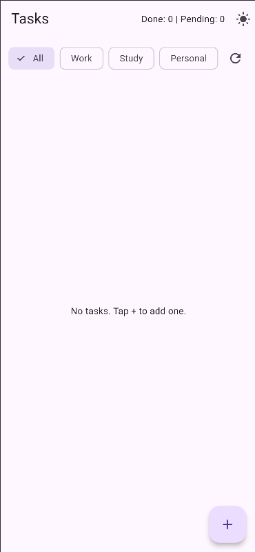
  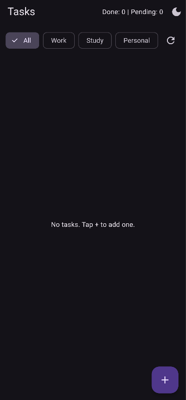
  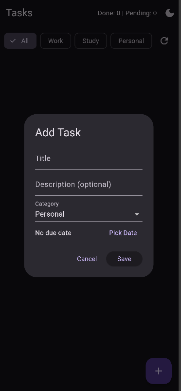
  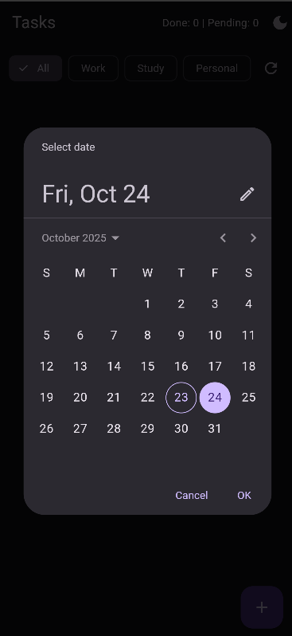
  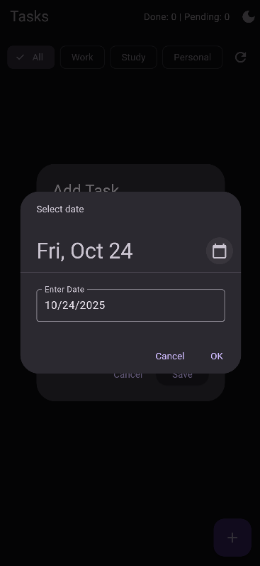
  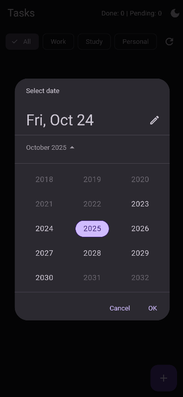
  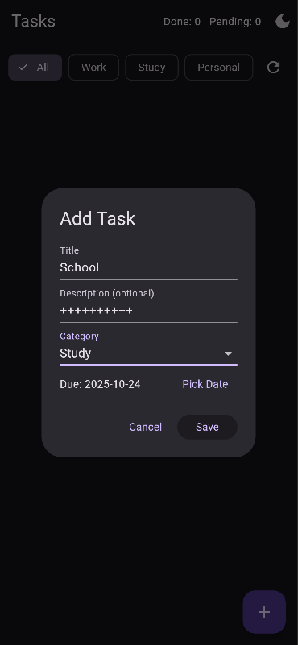
  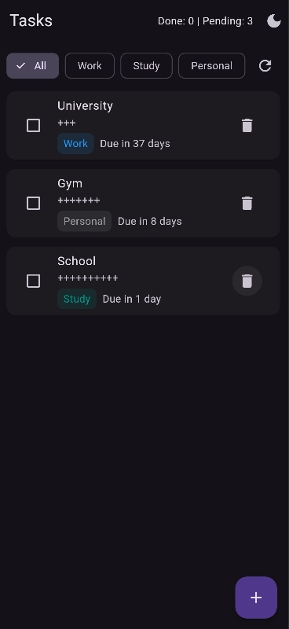
  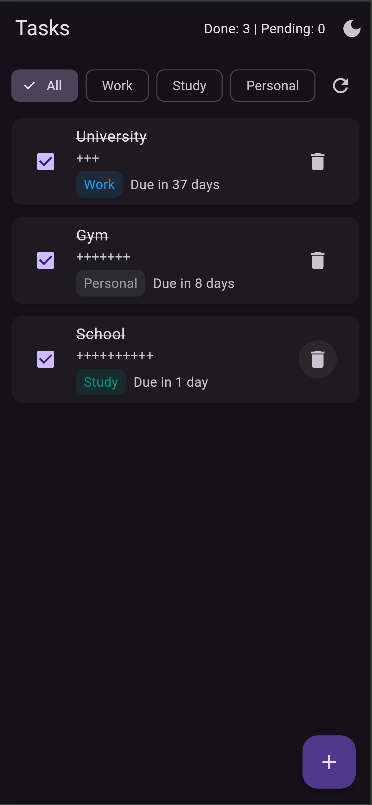
  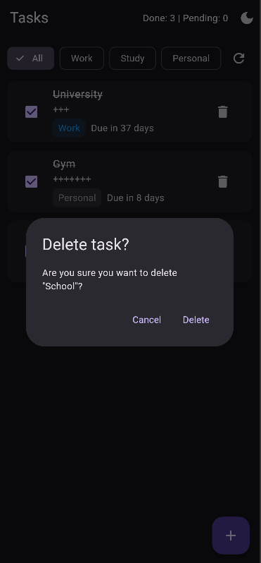
  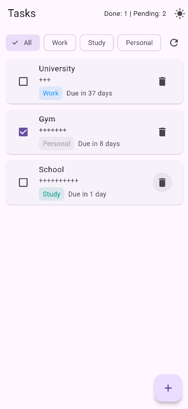

---

## 🧰 **Tech Stack**

**Framework:** Flutter (Dart)  
**Storage:** SharedPreferences  
**Design:** Material Design

## 📸 **UI Highlights**

Minimal blue, white, and gray color scheme  
Rounded cards and buttons  
Simple, user-friendly interface

---

**👨‍💻** Zubair Ahmed  
